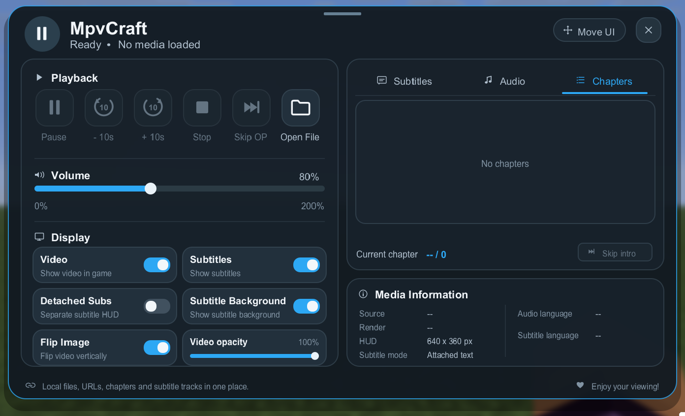
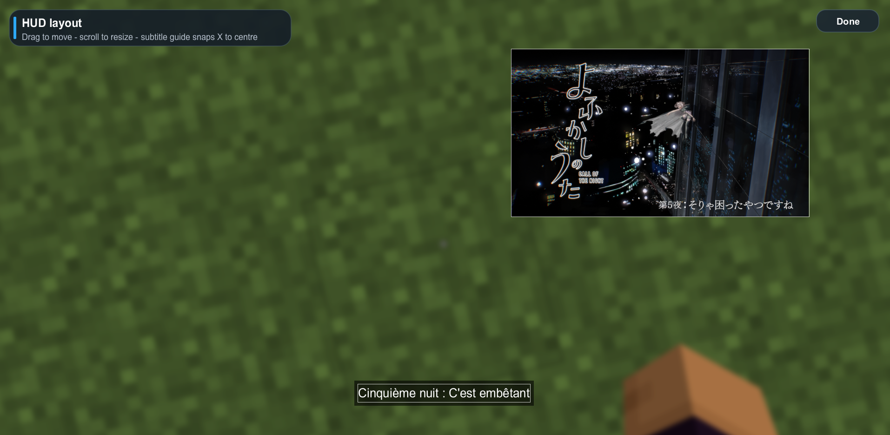

# MpvCraft

**MpvCraft is a client-side Fabric mod that embeds a libmpv-powered media player directly inside Minecraft.**

Play local videos or supported URLs in-game, move and resize the video independently from Minecraft's UI, select audio/subtitle tracks, browse chapters, and detach supported subtitles into their own HUD layer.

> **Status:** `0.1.0-alpha.2` is currently an unreleased development build. Core playback is usable, but some features are still experimental and may change.

## Screenshots

### Media controls



### HUD layout editor



## Features

- **libmpv-powered playback** inside Minecraft
- Local media files
- Direct media URLs such as `.mp4`, `.m3u8` and `.mpd`
- Optional **yt-dlp** integration for supported webpage URLs
- Fully custom in-game media control interface
- Movable and resizable video HUD
- Adjustable video opacity
- Volume control from 0% to 200%
- Audio track selection
- Subtitle track selection
- Chapter browser
- Vertical video flip
- Native file picker on Windows, macOS and Linux
- Detached text subtitles with:
  - independent position
  - independent scale
  - optional background
  - horizontal centre snapping
- Experimental detached image subtitles, including Blu-ray PGS
- Experimental **Skip Intro / Skip OP** based on chapter metadata
- Folder-backed playlists with name/date sorting and optional auto-next
- Clickable and draggable playback timeline with chapter markers
- Manual external subtitle loading from the media menu
- Independently scrollable settings and media-browser columns
- Minecraft-remappable media key bindings

## Requirements

MpvCraft currently requires:

- Minecraft **26.1.x**
- **Fabric Loader**
- **Fabric API**
- **Fabric Language Kotlin**
- A compatible **libmpv shared library installed separately**

JNA is bundled with MpvCraft and does **not** need to be installed separately.

> [!IMPORTANT]
> **libmpv is not bundled with MpvCraft.**
>
> Installing only `MpvCraft.jar`, Fabric API and Fabric Language Kotlin is not enough for video playback. Follow the libmpv installation instructions below.

---

# Installation

## Video installation guide

Prefer a video walkthrough? This guide covers the complete MpvCraft installation, including Fabric dependencies, libmpv setup, and the first launch.

[](https://youtu.be/bT_kmIrsdoQ)

**Watch on YouTube:** https://youtu.be/bT_kmIrsdoQ

## 1. Install Fabric

Install Fabric Loader for Minecraft 26.1.x, then add these mods to your instance's `mods` folder:

- MpvCraft
- Fabric API
- Fabric Language Kotlin

For the current alpha, the development versions are:

- Fabric Loader `0.19.5` or newer compatible version
- Fabric API `0.155.3+26.1.2` or newer compatible version
- Fabric Language Kotlin `1.14.1+kotlin.2.4.20` or newer compatible version

## 2. Install libmpv

MpvCraft talks directly to **libmpv**, the shared-library form of [mpv](https://mpv.io/).

The official mpv installation page is available here:

- https://mpv.io/installation/

### Windows

For Windows, a convenient source of current libmpv builds is **shinchiro's mpv Windows builds**.

The libmpv packages are available here:

- https://sourceforge.net/projects/mpv-player-windows/files/libmpv/

For a normal 64-bit Windows installation, download the latest archive named similar to:

```text
mpv-dev-x86_64-YYYYMMDD-git-XXXXXXXXXX.7z
```

Use the regular `x86_64` build for the safest compatibility.

The `x86_64-v3` build is only appropriate if your CPU supports the x86-64-v3 instruction set.

After downloading:

1. Extract the `.7z` archive somewhere permanent, for example:

   ```text
   C:\Tools\libmpv\
   ```

2. Find `mpv-2.dll` inside the extracted files.

3. Tell Java/MpvCraft where the DLL is by adding this JVM argument to your Minecraft instance:

   ```text
   -Dmpvcraft.libmpv=C:\Tools\libmpv\mpv-2.dll
   ```

   In most launchers, JVM arguments are available in the instance/profile Java settings.

4. Start Minecraft.

If libmpv is already available through the Windows library search path / `PATH`, MpvCraft may find it automatically, but the explicit JVM property above is the most reliable setup.

> [!TIP]
> You want the **`libmpv` / `mpv-dev`** package, not only a standalone `mpv.exe` player build.

### Linux

Install a package that provides the libmpv shared library, normally:

```text
libmpv.so.2
```

If the library is installed in a standard system library path, MpvCraft should detect it automatically.

Otherwise, pass the full path explicitly:

```text
-Dmpvcraft.libmpv=/path/to/libmpv.so.2
```

You can check whether the library is visible to the dynamic linker with a command such as:

```bash
ldconfig -p | grep libmpv
```

Package names vary by distribution, so refer to your distribution's mpv/libmpv package or the official mpv installation page:

- https://mpv.io/installation/

### macOS

Install mpv/libmpv using a package manager such as Homebrew or MacPorts, or another compatible build listed by mpv:

- https://mpv.io/installation/

For Homebrew:

```bash
brew install mpv
```

If the shared library is not detected automatically, provide its full path:

```text
-Dmpvcraft.libmpv=/path/to/libmpv.dylib
```

Typical Homebrew library locations are under:

```text
/opt/homebrew/lib/
```

on Apple Silicon, or:

```text
/usr/local/lib/
```

on Intel Macs.

## 3. Optional: install yt-dlp

`yt-dlp` is **not required** for local files or direct media URLs.

It is only used when you give MpvCraft a normal webpage URL that mpv cannot play directly.

Download yt-dlp from its official project:

- https://github.com/yt-dlp/yt-dlp

MpvCraft looks for yt-dlp in this order:

1. JVM property:

   ```text
   -Dmpvcraft.ytdlp=/path/to/yt-dlp
   ```

2. `ytDlpPath` in:

   ```text
   .minecraft/config/mpvcraft.json
   ```

3. Inside the Minecraft instance:

   ```text
   .minecraft/yt-dlp.exe
   .minecraft/tools/yt-dlp.exe
   .minecraft/mpvcraft/yt-dlp.exe
   ```

   On Linux/macOS the executable name is normally `yt-dlp`.

4. The system `PATH`

Website compatibility depends on yt-dlp and the website itself.

**DRM-protected media is not supported.**

---

# Usage

## Main menu

Run:

```text
/mpv
```

to open the MpvCraft control interface.

The menu provides:

- Play / Pause
- Seek -5s / +5s
- Stop
- Skip OP / Skip Intro
- Open Media (file or folder)
- Add external subtitle file
- Volume
- Video visibility
- Subtitle visibility
- Detached subtitle mode
- Subtitle background
- Vertical flip
- Video opacity
- Subtitle track selection
- Audio track selection
- Chapter selection
- Playlist browser, sorting and auto-next controls
- Clickable playback timeline
- HUD editor access

## HUD editor

From the `/mpv` menu, press **Move UI**.

Behavior is contextual:

```text
/mpv -> Move UI -> Esc / Done -> returns to the MpvCraft menu
```

Opening the editor directly behaves differently:

```text
/mpv hud -> Esc / Done -> returns directly to gameplay
```

Inside the HUD editor:

- drag the video to move it
- scroll over the video to resize it
- drag detached subtitles independently
- scroll over detached subtitles to resize them
- move a detached subtitle near the horizontal centre to enable persistent centre snapping

Text and supported bitmap subtitles keep their horizontal centre alignment as subsequent subtitle cues change width.

## Key bindings

MpvCraft registers normal Minecraft key mappings, so every binding can be changed from Minecraft's Controls menu.

Default Alpha 2 bindings:

- **Left Arrow** - seek backward 5 seconds
- **Right Arrow** - seek forward 5 seconds
- **K** - Play / Pause

---

# Commands

```text
/mpv
```

Open the main MpvCraft menu.

```text
/mpv hud
```

Open the HUD layout editor directly.

```text
/mpv play <path-or-url>
```

Load a local file or URL.

Example:

```text
/mpv play C:\Videos\episode.mkv
```

or:

```text
/mpv play https://example.com/video.m3u8
```

Additional commands:

```text
/mpv pause
/mpv stop
/mpv subs
/mpv audio
/mpv volume <0-200>
/mpv sub <file>
/mpv skipintro
/mpv cmd <mpv command>
```

`/mpv cmd` is an escape hatch for commands understood by mpv.

Example:

```text
/mpv cmd set speed 1.5
```

---

# Subtitles

## Text subtitles

Regular text subtitles can either stay attached to the video or be rendered as a separate Minecraft HUD element.

Detached text subtitles support:

- independent position
- independent scale
- configurable background
- horizontal centre snapping

## Bitmap / image subtitles

MpvCraft also contains experimental support for image-based subtitles such as:

- Blu-ray PGS
- VobSub / DVD subtitles
- DVB subtitles
- XSUB

mpv does not expose these subtitles as text. To detach them, MpvCraft uses a second muted libmpv core which renders the selected subtitle track onto a transparent surface.

MpvCraft then:

1. detects the visible non-transparent subtitle area
2. crops the transparent canvas
3. composites only the visible cue into Minecraft
4. allows that cue to be moved, resized and centre-snapped independently

This helper renderer is intentionally resolution- and update-rate-limited so it does not behave like a second full-resolution video renderer.

> [!WARNING]
> Detached bitmap subtitles are currently **experimental**.
>
> Compatibility can vary depending on the file, subtitle codec and libmpv build.

Detached bitmap subtitles are currently intended primarily for **local media files**.

Web/yt-dlp sources keep bitmap subtitles attached because a second network/resolver session cannot reliably guarantee identical track topology.

---

# Chapters and Skip Intro

MpvCraft reads chapter metadata from the loaded media and exposes chapters in the control menu.

The **Skip Intro / Skip OP** feature attempts to locate an opening using chapter metadata.

If a clearly named opening chapter is unavailable, fallback behavior may depend on the media's chapter structure.

> [!WARNING]
> **Skip Intro / Skip OP is experimental.**
>
> It may skip to the wrong location when chapters are missing, unnamed, unusual, or structured differently from expected.

---

# URL playback

There are two different URL cases.

## Direct media URLs

URLs that directly point to media can normally be passed straight to libmpv:

```text
https://example.com/video.mp4
https://example.com/master.m3u8
https://example.com/manifest.mpd
```

## Webpage URLs

A URL such as:

```text
https://example.com/watch/some-video
```

usually points to an HTML page, not directly to the video stream.

For supported websites, mpv's `ytdl_hook` can ask **yt-dlp** to resolve the page into the underlying media stream.

Unsupported sites, DRM-protected content, authentication requirements, anti-bot systems, or site-specific player logic may prevent playback.

MpvCraft does not implement DRM circumvention.

---

# Configuration

MpvCraft stores its configuration at:

```text
.minecraft/config/mpvcraft.json
```

Current settings include:

- video position
- video width
- video visibility
- video opacity
- detached subtitle position
- detached subtitle scale
- subtitle horizontal centre snap
- subtitle visibility
- subtitle background
- detached/attached subtitle mode
- bitmap subtitle scale and offset
- menu position
- volume
- vertical flip
- mpv hardware decoder option
- optional yt-dlp path
- playlist sort mode and direction
- playlist auto-next

## Hardware decoding

Hardware decoding is disabled by default:

```json
"hwdec": "no"
```

This is intentional because Minecraft uses a desktop OpenGL context and some Windows mpv hardware-decoding interop paths are not compatible with that setup.

If software decoding is too slow, an advanced user can experiment with a copy-back decoder such as:

```json
"hwdec": "d3d11va-copy"
```

Compatibility depends on the system and GPU driver.

---

# Current alpha limitations

`0.1.0-alpha.2` is an unreleased alpha development build and is not a stable release.

Known or expected limitations include:

- detached bitmap/PGS subtitles are experimental
- Skip Intro / Skip OP is experimental
- some unusual subtitle tracks may render incorrectly
- bitmap subtitle detaching is mainly intended for local files
- webpage URL compatibility depends on mpv and yt-dlp
- DRM-protected media is not supported
- unusual chapter or track metadata may not be interpreted correctly
- performance can vary depending on the OS, GPU, driver and libmpv build

Bug reports and compatibility feedback are welcome.

When reporting an issue, please include when relevant:

- Minecraft version
- Fabric Loader version
- Fabric API version
- Fabric Language Kotlin version
- operating system
- CPU/GPU
- libmpv build/version
- media container/codec
- subtitle codec
- steps to reproduce

---

# Building from source

## Requirements

- JDK 25
- Git

Clone the repository and run:

### Linux / macOS

```bash
./gradlew build
```

### Windows

```bat
gradlew.bat build
```

The compiled mod JAR will be produced under:

```text
build/libs/
```

For development, the Minecraft client can be launched with:

```bash
./gradlew runClient
```

or on Windows:

```bat
gradlew.bat runClient
```

---

# Development transparency

MpvCraft uses generative AI as a development assistant.

Generative AI has been used for parts of the custom UI implementation, code refactoring/reformatting, and documentation.

The project's architecture, feature design, libmpv/Fabric integration, testing, debugging, compatibility work, and final review are handled by the project maintainer.

Some implementation code may originate from AI-assisted generation, but it is reviewed, modified, tested, and integrated into the codebase before being published. Raw, unreviewed AI-generated code is not intentionally committed to the repository.

---

# Technical notes

Minecraft's GUI rendering pipeline and libmpv maintain independent OpenGL state.

MpvCraft renders libmpv into owned OpenGL framebuffers and bridges the resulting textures into Minecraft's picture-in-picture rendering path.

The video frame remains GPU-side; MpvCraft does not intentionally copy every video frame through system RAM.

Video opacity is applied to the rendered surface without asking libmpv to decode the frame again.

Bitmap subtitle rendering uses a separate subtitle-only helper core and composites only the detected visible alpha crop.

---

# License and credits

MpvCraft is distributed under the **BSD 3-Clause License**.

See [LICENSE](LICENSE).

Parts of:

- `MpvPipRenderer`
- HUD drag/scroll interaction

are adapted from **Odin** by odtheking under the BSD 3-Clause License:

- https://github.com/odtheking/OdinFabric

The required attribution is retained in the source and project license.

MpvCraft dynamically links to **libmpv**. mpv/libmpv builds may include components under additional licenses depending on how they were compiled. If you redistribute a libmpv build yourself, make sure its redistribution terms are compatible with your distribution.

## Related projects

- mpv: https://mpv.io/
- mpv source: https://github.com/mpv-player/mpv
- mpv installation guide: https://mpv.io/installation/
- shinchiro Windows libmpv builds: https://sourceforge.net/projects/mpv-player-windows/files/libmpv/
- yt-dlp: https://github.com/yt-dlp/yt-dlp
- Fabric: https://fabricmc.net/
